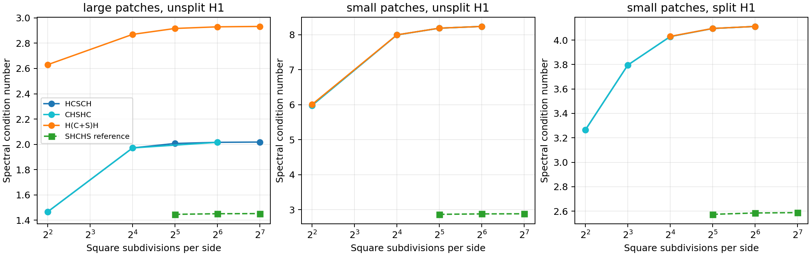

# Smoother-centered Johnson–Mercier HX on the square

This follow-up compares **HCSCH**, **CHSHC**, and **H(C+S)H** with the
previous **SHCHS** reference. The problem, patch definitions, auxiliary matrices,
boundary conditions, and square meshes are exactly those in
[the original study](hx_spectrum.md). All solves within S, H, and C are exact.
Weights below always mean **(wS,wH,wC)**; repeated letters use the same weight.

## What the compositions mean

Each letter is a weighted residual correction, not ordinary multiplication of
inverse matrices. For input x, initialize y=0, r=x, and apply
`z=wT*T*r; y+=z; r-=A*z` for each letter T.
For **H(C+S)H**, the middle correction is
`z=wC*C*r+wS*S*r`: **both summands see the same residual** and their damping
coefficients are independent. With L=wH H and M=wC C+wS S, its inverse action is

\[
 B=2L-LAL+(I-LA)M(I-AL).
\]

This identity and bilinear symmetry are checked for both patch sizes and both
H1 spaces, using three distinct weights. Application counts are:

| Composition | S applications | H applications | C applications |
|---|---:|---:|---:|
| SHCHS | 2 | 2 | 1 |
| HCSCH, CHSHC | 1 | 2 | 2 |
| H(C+S)H | 1 | 2 | 1 |

Condition numbers alone therefore do not settle execution time.

## Results

Putting S in the middle is stable with damping, but does not improve the
spectra of the earlier SHCHS choice. HCSCH and CHSHC are nearly indistinguishable
on fine meshes. The hybrid behaves differently by patch size: with small
patches it nearly reproduces the smoother-centered product spectrum while
saving one C solve; with large patches its additive center noticeably raises
the upper endpoint. Independent damping of C reduces that penalty.

The selected product weights are (1/3,1,1) for large patches, (.4,1,1) for
small/unsplit, and (.6,1,1) for small/split. Selected hybrid weights use the same
wS and wH, with **wC=.5**. These are near the best sampled choices; the r=2
hybrid grid has very shallow minima at wC=.4 for small/unsplit and wC=.6 for
small/split. Keeping .5 changes the respective sampled condition numbers by
only about 0.0005% and 0.0015%. The extra small/split (.5,1,1) product and
(.5,1,.5) hybrid refinement series are also retained as controls.

<!-- START_RESULTS -->
The finest accepted estimates are below. An upper endpoint of 1 for these
large-patch products is exact by the identity below (also used to sharpen
the earlier r=2 upper estimates in the refinement table). Other endpoints are
Lanczos estimates, rounded to six decimal places.

| Patch   | H1      | Composition   | (wS,wH,wC)   |   r |   DOFs |   lambda_min |   lambda_max |    kappa |
|:--------|:--------|:--------------|:-------------|----:|-------:|-------------:|-------------:|---------:|
| large   | unsplit | HCSCH         | (1/3,1,1)    |   5 | 295936 |     0.495534 |     1.000000 | 2.018027 |
| large   | unsplit | CHSHC         | (1/3,1,1)    |   4 |  74240 |     0.496073 |     1.000000 | 2.015832 |
| large   | unsplit | H(C+S)H       | (1/3,1,0.5)  |   5 | 295936 |     0.495534 |     1.453243 | 2.932683 |
| large   | split   | HCSCH         | (1/3,1,1)    |   5 | 295936 |     0.495534 |     1.000000 | 2.018027 |
| large   | split   | CHSHC         | (1/3,1,1)    |   4 |  74240 |     0.496073 |     1.000000 | 2.015832 |
| large   | split   | H(C+S)H       | (1/3,1,0.5)  |   4 |  74240 |     0.496073 |     1.453242 | 2.929493 |
| small   | unsplit | HCSCH         | (0.4,1,1)    |   4 |  74240 |     0.144468 |     1.190063 | 8.237534 |
| small   | unsplit | CHSHC         | (0.4,1,1)    |   4 |  74240 |     0.144468 |     1.190064 | 8.237536 |
| small   | unsplit | H(C+S)H       | (0.4,1,0.5)  |   4 |  74240 |     0.144468 |     1.190081 | 8.237683 |
| small   | split   | HCSCH         | (0.6,1,1)    |   4 |  74240 |     0.350007 |     1.439067 | 4.111542 |
| small   | split   | CHSHC         | (0.6,1,1)    |   4 |  74240 |     0.350007 |     1.439071 | 4.111553 |
| small   | split   | H(C+S)H       | (0.6,1,0.5)  |   4 |  74240 |     0.350005 |     1.439088 | 4.111624 |

Refinement history for the selected weights (a missing entry was not run):

| Patch   | H1      | Composition   |      r=2 |        r=3 |      r=4 |        r=5 |
|:--------|:--------|:--------------|---------:|-----------:|---------:|-----------:|
| large   | unsplit | HCSCH         | 1.971401 |   2.006968 | 2.015832 |   2.018027 |
| large   | unsplit | CHSHC         | 1.971397 | —        | 2.015832 | —        |
| large   | unsplit | H(C+S)H       | 2.869718 |   2.916621 | 2.929493 |   2.932683 |
| small   | unsplit | HCSCH         | 7.994975 |   8.187567 | 8.237534 | —        |
| small   | unsplit | CHSHC         | 7.995010 |   8.187576 | 8.237536 | —        |
| small   | unsplit | H(C+S)H       | 7.997314 |   8.188160 | 8.237683 | —        |
| small   | split   | HCSCH         | 4.028766 |   4.094659 | 4.111542 | —        |
| small   | split   | CHSHC         | 4.028939 |   4.094703 | 4.111553 | —        |
| small   | split   | H(C+S)H       | 4.030134 |   4.094989 | 4.111624 | —        |

The observed changes are approximately quadratic in mesh width. A two-level
h-squared extrapolation suggests **2.019** for the large-patch products,
**2.934** for the large hybrid, **8.25** for small/unsplit, and **4.12** for
small/split (both new compositions). These are empirical limiting estimates,
not proved continuum limits. The earlier SHCHS reference instead approaches
about **1.453**, **2.883**, and **2.589**, respectively, at weights (.4,1,1)
for large and (.6,1,1) for small patches.

Independent seed/Krylov-size checks agree in the large r=4 lower endpoint to
about 6e-10 relative. The small r=3 comparisons differ by at most 1.44e-7
relative, reflecting tightly clustered lower modes. A stricter small/unsplit
hybrid repeat at r=4 (seed 71, ncv=240, tolerance 1e-9) agrees with the original
(seed 17, ncv=120, tolerance 1e-8) in both endpoints to the 12 digits retained
in the CSV. This supports the displayed precision; residual convergence alone
is not a proof that a nearby extremal mode has not been missed.

<!-- END_RESULTS -->



At matched weights, the distinction is already clear at r=3. For large patches
and (1,1,1), HCSCH has kappa about 3.939 versus 5.068 for H(C+S)H. For small
patches the same comparison is 8.459 versus 8.460 (unsplit), or 4.2817 versus
4.2822 (split). Thus the additive center's penalty is not universal in size.
The separately damped large hybrid at (1/3,1,.5) improves substantially over
copying the product's C weight: at r=2, kappa decreases from 3.85059 to 2.86972.

These are spectral comparisons with exact auxiliary solves. They establish
neither a runtime ranking nor scalability of the direct factorizations.

## Parameter search

Every screening set below is crossed with small/large patches and
split/unsplit H1. No assertion of continuous weight optimality is intended.

* `middle`, r=0,1,2,3: HCSCH and CHSHC at (1,1,1) and at
  (.4,1,1) for large / (.6,1,1) for small; H(C+S)H at those two weights,
  (1,1,.5), (2,1,1), (1,.5,1), (2,.5,1); SHCHS at the matched weights.
  There are 44 configurations per mesh.
* `middle_tune`, r=2: each product with wS in {.5,1,2,4}, wH in {.5,1},
  wC=1; hybrid with wS in {.5,1,2}, wH in {.5,1}, wC in {.5,1,2}.
  There are 136 configurations.
* `middle_refine`, r=2: each product with wS in {.25,1/3,.4,.5,.6,.75,1},
  wH=wC=1; hybrid with the same wS, wH=1 and
  wC in {.25,.4,.5,.6,.75,1}. There are 224 configurations.

## Numerical method and upper endpoints

Lanczos uses the A inner product, or equivalently the symmetric generalized
pencil (ABA,A). Full Lanczos uses two reorthogonalization passes; restarted
Lanczos uses ARPACK. Explicit A-norm Ritz residuals are retained in the CSV.
All 44 r=0 spectra were also checked against the complete dense spectrum.

Large-patch smoother-centered products have tightly clustered upper eigenvalues,
so an upper Ritz vector may converge much more slowly than its eigenvalue.
Here there is an independent analytical enclosure. Local patch support overlap
is at most three, giving lambda_max(SA)<=3. The H1 energy controls A with
constant two, giving lambda_max(HA)<=2. At wH<=1, the H error factor is an
A contraction; at wC=1 the C error factor is an A-orthogonal projection.
Consequently, for either smoother-centered palindrome,

\[
 \lambda_{\max}(BA)\le U=\max(1,3w_S).
\]

The C factor also makes the error operator rank deficient, so 1 is an eigenvalue
of BA. Thus **wS<=1/3 gives lambda_max=1 exactly**. For wS>1/3, a true Ritz
Rayleigh quotient theta gives the enclosure [theta,U]. `max_upper_bound` and
`max_upper_gap` retain U and U-theta. Screening may accept a relative bracket
width of 1e-4; this is explicitly different from a converged upper eigenvector.
The original strict screening failures remain flagged, not silently treated as
precise spectra. Dense checks, direct residuals, and independent starts provide
numerical validation, not interval-arithmetic certification of every eigenvalue.

## Reproduction and retained data

Use the build instructions and machine/library provenance in the
[original report](hx_spectrum.md). Run in `addisons_experiments/build` with
`OPENBLAS_NUM_THREADS=1`; all commands below use `./hx_spectrum`.
The [retained CSV](../results/hx_middle.csv) includes source-study labels,
weights, exact order strings, mesh sizes, numerical settings, endpoint residuals,
and acceptance flags. It contains 596 runs: 507 accepted and 89 flagged failures
(35 in the broad tuning grid, 30 in the refined grid, 16 in the initial
refinement screen, and eight superseded full-Lanczos attempts). Every selected
fine-grid and independent-repeat run converged. Screen failures and superseded exploratory estimates
remain visible. The early `middle_third` series used a 200-vector full-Lanczos
cap and failed its requested tolerances; use `middle_third_exact` instead.
Its exact-one upper endpoint is obtained with restarted minimum-only Lanczos;
the collected CSV corrects an early driver label that called this `full_bound`.

```sh
export OPENBLAS_NUM_THREADS=1
./hx_spectrum -r 0 -select middle -tol 1e-8 -max-it 100 > middle_coarse2.csv
./hx_spectrum -r 1 -levels 3 -select middle -tol 1e-7 -max-it 100 > middle_screen2.csv
./hx_spectrum -r 2 -select middle_tune -tol 1e-7 -max-it 100 > middle_tune2.csv
./hx_spectrum -r 2 -select middle_refine -tol 1e-7 -bound-tol 1e-4 -max-it 30 > middle_refine.csv
./hx_spectrum -r 0 -select middle_chosen -tol 1e-9 > middle_chosen_coarse.csv
# Superseded exploratory cap (all eight rows failed the requested tolerance):
./hx_spectrum -r 3 -levels 2 -select custom -order HCSCH -ws .3333333333333333 -wh 1 -wc 1 -tol 1e-8 -full -max-it 200 > middle_third.csv
# Accepted exact-upper-endpoint refinement series:
./hx_spectrum -r 3 -levels 3 -select custom -order HCSCH -ws .3333333333333333 -wh 1 -wc 1 -tol 1e-8 -patch large > middle_third_exact.csv
./hx_spectrum -r 3 -levels 3 -select custom -order 'H(C+S)H' -ws .3333333333333333 -wh 1 -wc .5 -tol 1e-8 -patch large -h1 unsplit > hybrid_large_fine.csv
./hx_spectrum -r 3 -levels 2 -select middle_chosen -patch small -tol 1e-8 -ncv 120 -max-it 100 -no-bound-center > middle_small_fine.csv
./hx_spectrum -r 3 -levels 2 -select middle_best -patch small -h1 split -tol 1e-8 -ncv 120 -max-it 100 -no-bound-center > middle_split_best.csv
./hx_spectrum -r 4 -select middle_chosen -patch large -tol 1e-8 -seed 71 -ncv 120 -max-it 100 > middle_large_check.csv
./hx_spectrum -r 3 -select middle_best -patch small -tol 1e-8 -seed 71 -ncv 160 -max-it 100 -no-bound-center > middle_small_check.csv
./hx_spectrum -r 4 -select custom -patch small -h1 unsplit -order 'H(C+S)H' -ws .4 -wh 1 -wc .5 -tol 1e-9 -ncv 240 -seed 71 -max-it 100 -no-bound-center > middle_small_fine_check.csv
```

`middle_chosen` uses wS=.5 for small/split; `middle_best` uses .6. Both use
wS=.4 for small/unsplit and 1/3 for large, wH=1, and wC=1 for products / .5
for the hybrid. The final driver automatically exploits the exact-one endpoint
for centered S at wS<=1/3; the earlier screens used full Lanczos there, so their
iteration counts and reported upper estimates need not reproduce bit for bit.

All seven experiment CTests pass, including distinct-weight grouped-composition
and dense-spectrum checks. Rebuild and run `ctest --test-dir
addisons_experiments/build --output-on-failure` after changing the code.
Replot with `MPLCONFIGDIR=/tmp/jm-mpl python3
addisons_experiments/johnson_mercier/plot_hx_middle.py`.
