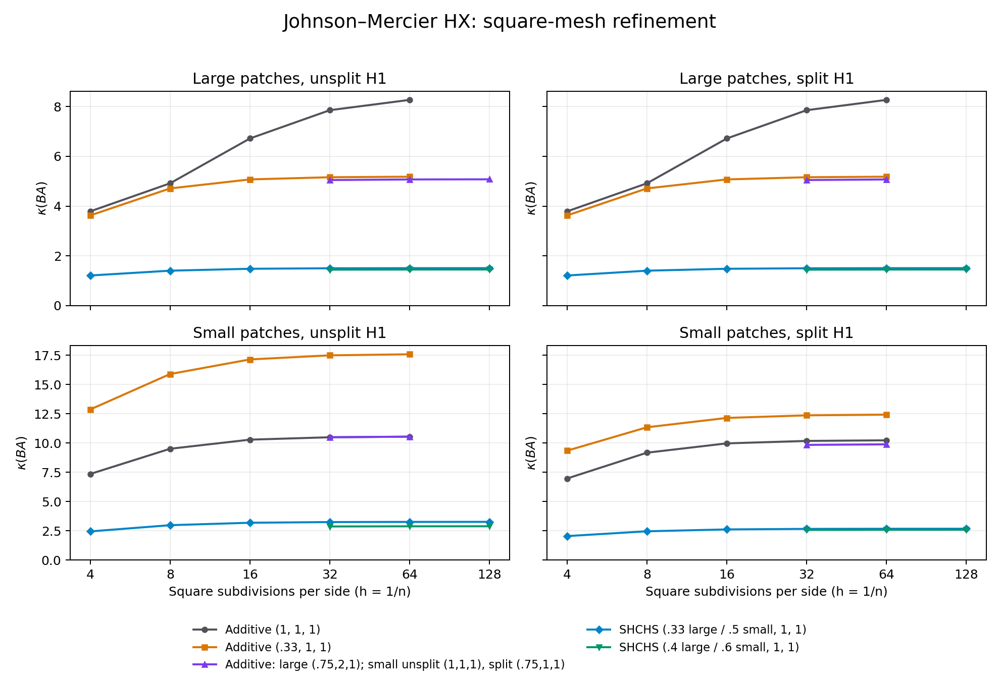

# Johnson–Mercier HX spectra on the square

Damped symmetric multiplicative HX has substantially better spectra than the
tested additive variants. Splitting H1 helps small patches, but has negligible
effect on large patches at fine resolution. Undamped SHCHS is indefinite.

This experiment estimates extremal eigenvalues, rather than inferring condition
numbers from CG iterations. All reported condition numbers refer to the
preconditioned **energy** spectrum; an indefinite configuration has no SPD
condition number. Finite-mesh trends are evidence about a limit, not a proof
of a uniform bound or an exact infinite-refinement limit.

## Problem and exact configurations

The domain is the unit square, with the repository's `data/inline-tri.mesh`:
4 by 4 squares split into 32 triangles, followed by uniform refinement.
At refinement `r`, the grid has `n=4*2^r` subdivisions per side,
`2*n^2` macro triangles, and `18*n^2+8*n` JM stress DOFs. There are no essential
stress boundary conditions. The operator is

\[
 A(\sigma,\tau)=(\sigma,\tau)+(\operatorname{div}\sigma,
 \operatorname{div}\tau).
\]

The three unweighted inverse corrections are:

* **S, patches.** Small patches are the intrinsic split-vertex spaces: two
  traction endpoint DOFs per incident macro edge at an original vertex, and
  a separate three-DOF block at each triangle barycenter. They partition the
  split-vertex coordinates. Large patches contain all four DOFs on incident
  edges and all three DOFs in incident triangles, and overlap. An interior
  regular-grid vertex has a 12-DOF small block or a 42-DOF large patch.
  All local blocks are solved exactly. Both are assembled in split-vertex
  coordinates and mapped to common moment coordinates by congruence.
* **H, smooth correction.** Continuous symmetric-tensor P1 on the macro mesh
  (unsplit), or on the explicit three-way Alfeld subdivision (split).
  Its auxiliary matrix is the tensor H1 mass-plus-diffusion operator with
  Frobenius weights `(1,2,1)`. It is inverted directly with UMFPACK and transferred
  using the existing interpolation/inclusion. It is not a Galerkin inverse of
  the div-div operator restricted to that space.
* **C, Airy correction.** Macro-mesh HCT, Hessian-energy inverse, with value and
  both first derivatives at vertex zero fixed to remove its affine kernel.
  The Airy map transfers the exact UMFPACK correction to stress space.

Additive configurations mean exactly `B = wS*S + wH*H + wC*C`. A common
rescaling changes both extremal eigenvalues by the same factor and leaves the
condition number unchanged, so two independent weight ratios suffice.

For a multiplicative string such as **SHCHS**, start with `y=0, r=x`, then,
for each letter `T` in the printed order, perform `z=wT*T*r`, `y+=z`,
`r-=A*z`. The returned preconditioner is `x -> y`. Repeated letters use the
same weight. These palindromic sweeps are symmetric. They cost two patch
applications, two H1 applications and one Airy application for SHCHS/HSCSH;
SCHCS instead uses two patch, two Airy and one H1 application. These are not
single forward, nonsymmetric sweeps.

The broad screening configurations, crossed with both patch sizes and both
H1 spaces, are:

| Name | Composition | `(wS,wH,wC)` |
|---|---|---|
| base | additive | `(1,1,1)` |
| s01, s033, s3, s10 | additive | `(.1,1,1)`, `(.33,1,1)`, `(3,1,1)`, `(10,1,1)` |
| h033, h3 | additive | `(1,.33,1)`, `(1,3,1)` |
| c033, c3 | additive | `(1,1,.33)`, `(1,1,3)` |
| balanced | additive | `(.33,1,1)` large; `(.5,1,1)` small |
| mult_SHCHS | SHCHS | `(.33,1,1)` large; `(.5,1,1)` small |
| mult_HSCSH | HSCSH | same weights |
| mult_SCHCS | SCHCS | same weights |
| mult_raw | SHCHS | `(1,1,1)` |

The `balanced` large-patch row intentionally duplicates `s033`. In the main restarted study, undamped
multiplication is retained on the coarsest mesh only, since its complete dense
spectrum already establishes indefiniteness. The independent full-Lanczos
archive also includes exploratory undamped checks at `r=1,2`.

At `r=2`, additional tuning uses additive weights
`wS in {.25,.33,.5,.75,1,1.5,2}`, `wH in {.5,1,2,3}`, `wC=1`, and SHCHS
weights `wS in {.2,.33,.4,.5,.6}`, `wH in {.5,1}`, `wC=1`. These 38 choices
are tested for large/unsplit and small/{unsplit,split}. This is a discrete
parameter search, not a claim of globally optimal weights.

The subsequent `chosen_add` weights are `(.75,2,1)` for large patches,
`(1,1,1)` for small/unsplit, and `(.75,1,1)` for small/split. The
`chosen_mult` SHCHS weights are `(.4,1,1)` for large patches and
`(.6,1,1)` for small patches.

## Results and numerical refinement limits

The strongest tested spectra come from **damped symmetric multiplication with
Airy in the middle**. Joint tuning improves large-patch additive HX modestly,
but its limiting condition number remains substantially larger. The small-patch
smoother needs different weights; copying the large-patch additive damping is
harmful. Splitting H1 helps small-patch multiplicative HX, while its effect on
large patches is negligible on fine grids.



The retained study comprises the full 56-row coarse screen and 52-row screens
at each of `r=1,2,3`; 114 joint-weight trials at `r=2`; the reference and selected
fine-grid configurations in the tables; and independent validation repeats.
At `r=5`, both reference and selected SHCHS weights are tested for all four
patch/H1 combinations, plus selected additive weights for large/unsplit.

All weights below are ordered **(patch, H1, Airy)**. A displayed endpoint of 1
for an Airy-centered sweep uses the projection identity explained below.

### Finest accepted eigenvalue estimates

| Patch   | H1      | Composition   | (wS,wH,wC)   |   r |   DOFs |   lambda_min |   lambda_max |     kappa |
|:--------|:--------|:--------------|:-------------|----:|-------:|-------------:|-------------:|----------:|
| large   | unsplit | add           | (1,1,1)      |   4 |  74240 |     0.513277 |     4.244442 |  8.269307 |
| large   | unsplit | add           | (0.33,1,1)   |   4 |  74240 |     0.437736 |     2.268204 |  5.181666 |
| large   | unsplit | add           | (0.75,2,1)   |   5 | 295936 |     0.944740 |     4.796654 |  5.077223 |
| large   | unsplit | SHCHS         | (0.33,1,1)   |   5 | 295936 |     0.663539 |     1.000000 |  1.507069 |
| large   | unsplit | SHCHS         | (0.4,1,1)    |   5 | 295936 |     0.688607 |     1.000000 |  1.452206 |
| large   | split   | add           | (1,1,1)      |   4 |  74240 |     0.513277 |     4.244442 |  8.269307 |
| large   | split   | add           | (0.33,1,1)   |   4 |  74240 |     0.437736 |     2.268204 |  5.181666 |
| large   | split   | add           | (0.75,2,1)   |   4 |  74240 |     0.945780 |     4.796562 |  5.071541 |
| large   | split   | SHCHS         | (0.33,1,1)   |   5 | 295936 |     0.663539 |     1.000000 |  1.507069 |
| large   | split   | SHCHS         | (0.4,1,1)    |   5 | 295936 |     0.688607 |     1.000000 |  1.452206 |
| small   | unsplit | add           | (1,1,1)      |   4 |  74240 |     0.296039 |     3.121198 | 10.543188 |
| small   | unsplit | add           | (0.33,1,1)   |   4 |  74240 |     0.113738 |     2.000027 | 17.584460 |
| small   | unsplit | SHCHS         | (0.5,1,1)    |   5 | 295936 |     0.306792 |     1.000000 |  3.259537 |
| small   | unsplit | SHCHS         | (0.6,1,1)    |   5 | 295936 |     0.347012 |     1.000000 |  2.881746 |
| small   | split   | add           | (1,1,1)      |   4 |  74240 |     0.340065 |     3.479232 | 10.231088 |
| small   | split   | add           | (0.33,1,1)   |   4 |  74240 |     0.161006 |     2.000028 | 12.422068 |
| small   | split   | add           | (0.75,1,1)   |   4 |  74240 |     0.284792 |     2.815361 |  9.885659 |
| small   | split   | SHCHS         | (0.5,1,1)    |   5 | 295936 |     0.374314 |     1.000000 |  2.671551 |
| small   | split   | SHCHS         | (0.6,1,1)    |   5 | 295936 |     0.386429 |     1.000000 |  2.587798 |

The table consolidates duplicate physical configurations and uses each configuration's finest **accepted** run; DOF counts can differ.

### Refinement sequences

The following condition numbers expose whether an apparent plateau is supported
by the finer meshes. A dash means no accepted estimate was retained at that level.

| Patch / H1      | Configuration   | r=0       | r=1       | r=2       |      r=3 |      r=4 | r=5      |
|:----------------|:----------------|:----------|:----------|:----------|---------:|---------:|:---------|
| large / unsplit | base            | 3.788785  | 4.916537  | 6.718843  |  7.85528 |  8.26931 | —        |
| large / unsplit | s033            | 3.625734  | 4.711289  | 5.072844  |  5.16059 |  5.18167 | —        |
| large / unsplit | chosen_add      | —         | —         | —         |  5.04789 |  5.07154 | 5.077223 |
| large / unsplit | mult_SHCHS      | 1.211352  | 1.405006  | 1.482189  |  1.50133 |  1.50595 | 1.507069 |
| large / unsplit | chosen_mult     | —         | —         | —         |  1.44619 |  1.45104 | 1.452206 |
| small / unsplit | base            | 7.353039  | 9.508301  | 10.287586 | 10.4923  | 10.5432  | —        |
| small / unsplit | s033            | 12.867054 | 15.895852 | 17.145185 | 17.495   | 17.5845  | —        |
| small / unsplit | chosen_add      | —         | —         | —         | 10.4923  | 10.5432  | —        |
| small / unsplit | mult_SHCHS      | 2.442949  | 2.974506  | 3.183386  |  3.24116 |  3.25586 | 3.259537 |
| small / unsplit | chosen_mult     | —         | —         | —         |  2.86576 |  2.87855 | 2.881746 |
| small / split   | base            | 6.966691  | 9.173266  | 9.969208  | 10.179   | 10.2311  | —        |
| small / split   | s033            | 9.345090  | 11.345587 | 12.144284 | 12.3656  | 12.4221  | —        |
| small / split   | chosen_add      | —         | —         | —         |  9.83849 |  9.88566 | —        |
| small / split   | mult_SHCHS      | 2.042856  | 2.453719  | 2.613518  |  2.65756 |  2.66875 | 2.671551 |
| small / split   | chosen_mult     | —         | —         | —         |  2.57373 |  2.58498 | 2.587798 |

For context, `r=0,...,5` has **320, 1,216, 4,736, 18,688, 74,240,
295,936** stress DOFs. Large-patch split-H1 sequences are almost identical to
unsplit ones and are included in the CSV and finest-value table.

These data suggest the following **numerical limits**, rounded deliberately
more coarsely than the finite-dimensional eigenvalue estimates. As a rough guide,
use the last two accepted levels in `kappa_inf ≈ (4*kappa_fine-kappa_coarse)/3`,
i.e. a linear extrapolation in `h^2`. The near-plateau sequences have refinement
increments consistent with this approximation; no asymptotic error law is proved:

* Large patches, additive `(.33,1,1)`: condition number about **5.19**.
* Large patches, additive `(.75,2,1)`: about **5.08**.
* Large patches, SHCHS `(.33,1,1)`: about **1.508**.
* Large patches, SHCHS `(.4,1,1)`: about **1.453**.
* Small patches, unsplit H1, additive `(1,1,1)`: about **10.56**.
* Small patches, split H1, additive `(.75,1,1)`: about **9.90**.
* Small patches, unsplit H1, SHCHS `(.5,1,1)`: about **3.261**;
  increasing the patch weight to `.6` improves this to about **2.883**.
* Small patches, split H1, SHCHS `(.5,1,1)`: about **2.672**;
  increasing the patch weight to `.6` improves this to about **2.589**.

These are empirical plateau/extrapolation descriptions, not certified continuum
limits. In particular, the unweighted large-patch additive sequence is still
changing appreciably at its last accepted level; an estimate near 8.5 is plausible
but less well established than the damped and tuned limits above.

### Rescaling, splitting, and order interact

Here is the **complete broad screen at r=3 (18,688 DOFs)**. Entries are condition
numbers. The configuration definitions and weights are listed in the preceding
table; no weights change between the split and unsplit H1 columns.

| config     |   Large / unsplit |   Large / split |   Small / unsplit |   Small / split |
|:-----------|------------------:|----------------:|------------------:|----------------:|
| balanced   |          5.160595 |        5.160595 |         12.545267 |       10.129074 |
| base       |          7.855278 |        7.855277 |         10.492314 |       10.178972 |
| c033       |         12.709519 |       12.709515 |         10.495984 |       10.546085 |
| c3         |         10.845081 |       10.845081 |         13.448330 |       11.703918 |
| h033       |         18.915905 |       18.915903 |         17.837515 |       18.147537 |
| h3         |          6.784456 |        6.784435 |         15.722706 |       11.423324 |
| mult_HSCSH |          1.501334 |        1.501334 |          3.241159 |        2.657563 |
| mult_SCHCS |          2.754442 |        2.754444 |          4.993850 |        4.378084 |
| mult_SHCHS |          1.501330 |        1.501330 |          3.241162 |        2.657559 |
| s01        |         13.356966 |       13.356969 |         55.261994 |       31.752674 |
| s033       |          5.160595 |        5.160595 |         17.495014 |       12.365622 |
| s10        |         38.867887 |       38.867881 |         51.846216 |       52.113944 |
| s3         |         16.575436 |       16.575434 |         17.687509 |       17.992756 |

Several contrasts matter:

* Reducing the additive patch weight to `.33` helps large patches, but hurts
  small patches: with unsplit H1 at `r=3`, the condition number changes
  **7.855 → 5.161** versus **10.492 → 17.495**.
* Increasing the H1 weight to 3 helps large patches on fine grids
  (**7.855 → 6.784**) but hurts small patches (**10.492 → 15.723** unsplit,
  **10.179 → 11.423** split). On the coarsest large-patch mesh it instead
  worsens the condition number (**3.789 → 5.906**): coarse tuning can mislead.
* Decreasing or increasing the Airy weight from 1 to `.33` or 3 does not improve
  any of these four `r=3` baseline patch/H1 combinations.
* The two Airy-centered orders SHCHS and HSCSH are extremely close. Moving H1
  to the middle, SCHCS, is substantially worse: **1.501 → 2.754** for large
  patches, **3.241 → 4.994** for small/unsplit, and **2.658 → 4.378** for
  small/split, with the same weights.
* The high additive smoother weights 3 and 10 have not settled by `r=3`.
  For large/unsplit, weight 3 reaches **19.111** at `r=4`; no well-resolved
  limiting value is claimed for these heavily weighted cases.

The `r=2` joint search gives its smallest additive condition number at
`(.75,2,1)` for large/unsplit, `(1,1,1)` for small/unsplit, and `(2,3,1)` for
small/split. The last has condition number 9.642891, only 0.07% better than the
simpler `(.75,1,1)` choice (9.649952), which was selected for further refinement.
For SHCHS the best sampled weights are `(.4,1,1)` for large/unsplit and
`(.6,1,1)` for both small-patch H1 choices. These are best among the stated
finite sets, not optimized over all positive weights.

### Undamped multiplicative composition is indefinite

At `r=0`, the complete dense spectrum gives these smallest eigenvalues for
SHCHS with weights `(1,1,1)`:

| patch   | h1      |   lambda_min |   lambda_max |
|:--------|:--------|-------------:|-------------:|
| large   | split   |    -2.985880 |     1.000000 |
| large   | unsplit |    -2.999997 |     1.000000 |
| small   | split   |    -1.139697 |     1.000000 |
| small   | unsplit |    -2.826428 |     1.000000 |

Consequently these sweeps are not SPD preconditioners for PCG. Symmetrizing a
sequence alone does not make unrestricted local relaxation positive definite.
The patch term is an aggregate of local inverse corrections; it is not itself
an energy projection. Damping is essential here.

### Accuracy and scope of the retained data

The selected CSV contains **390 rows: 389 accepted spectra** (including the
four indefinite coarse configurations) and one explicitly unconverged validation
row. Every computed Ritz residual in an accepted selected row is below `9.9e-8`.

The complete dense coarse-grid check agrees with the restarted estimates to
about `1e-11` relative at the reported precision. All 24 `r=3` core comparisons
were repeated with seed 71 and Krylov dimension 120 (instead of seed 17 and 80):
the extremal eigenvalues agree within **1.3e-8 relative**. Across 140 accepted
full-Lanczos comparisons at `r=0,1,2`, agreement with restarted Lanczos is within
**1.2e-8 relative**. The finest large/unsplit SHCHS `(.4,1,1)` case was also repeated with seed 71
and Krylov dimension 120: its smallest eigenvalue agrees to **1.1e-11 relative**.
Five standalone CTest checks pass, including dense spectral
checks for both additive and multiplicative preconditioners.

The independent 400-step full-Lanczos screen accepted 140 of 168 rows; the other
28 are explicitly marked unconverged in `hx_spectrum_full_check.csv` and are not
used for precise bounds. A 300-step full-Lanczos check of the unweighted
large/unsplit additive operator at `r=5` also failed the requested tolerance:
its smallest-eigenvalue relative residual was `3.83e-4`. That row is retained
with `converged=0` and excluded from the tables above. Its largest endpoint was
well resolved, but this does not validate its condition-number estimate.

[Selected data](../results/hx_spectrum.csv) include both extremal eigenvalues,
weights, spaces, composition, seed, tolerances, method and residuals.
[Independent full-Lanczos checks](../results/hx_spectrum_full_check.csv) retain
both successful and unsuccessful checks. The plot can be regenerated with
`MPLCONFIGDIR=/tmp/jm-mpl python3 johnson_mercier/plot_hx_spectrum.py` from
`addisons_experiments` (default output is in the ignored `output/` directory).

## Lanczos and numerical validation

`hx_spectrum.cpp` uses the symmetric generalized pencil `(A B A, A)`:
its operator is `B A` and its inner product is `x^T A y`. Applying ordinary
Euclidean symmetric Lanczos directly to `BA` would be incorrect.
[ARPACK's generalized symmetric mode 2](https://github.com/opencollab/arpack-ng/blob/master/SRC/dsaupd.f)
provides implicitly restarted Lanczos. Here `A^{-1}(ABA)x=BAx` is evaluated
without an inverse solve. The driver also provides an independent, unrestarted,
twice fully reorthogonalized Lanczos procedure (`-full`).

Each computed extremal Ritz vector is checked by explicitly recomputing

\[
 \rho=\frac{\|BAu-\theta u\|_A}{|\theta|\|u\|_A}.
\]

The CSV retains the requested tolerance, Krylov dimension, seed, operator
application count, and actual residuals. The `dense_*` columns are computed
only on the coarsest mesh; zeros elsewhere mean not computed. The acceptance threshold for restarted
runs is `max(10*tol,1e-7)`. These are double-precision residual checks, not
interval-arithmetic certificates. A small residual locates a nearby eigenvalue;
it does not alone certify that no more extreme eigenvalue was missed. Dense
coarse-grid spectra, a separate Lanczos implementation, different starts and
larger Krylov spaces provide additional checks.

For sweeps with weight-one **C in the middle**, the largest eigenvalue is
available exactly. `P=CA` is an A-orthogonal projection because Airy stresses
are divergence-free and their mass energy equals the HCT Hessian energy.
The palindrome gives

\[
 I-BA=F^{*_A}(I-P)F.
\]

This is positive semidefinite and rank deficient, so `lambda_max(BA)=1`.
This identity holds even when `lambda_min(BA)<0`. Such rows use Lanczos only
for the smallest eigenvalue; `max_method=projector_identity` identifies them.
Their `res_max=0` is a placeholder for the identity, **not** a measured Ritz
residual. The full-Lanczos and dense coarse-grid checks also estimate that
endpoint independently. The projection identity and preservation of the
original additive auxiliary action have regression tests.

## Reproduction and provenance

Source baseline: `6ab6309f2f055db2d23980f7c34d5a1e57c6d50b`, with the
accompanying uncommitted experimental driver, separate H1/Airy application
methods, CMake target and tests. No MFEM library source changes are required.
Runs used the existing Release `build-hx` MFEM build, SuiteSparse/UMFPACK,
GCC 16.2.1, LP64 OpenBLAS LAPACK and ARPACK, on AMD Ryzen 7 5825U, with
`OPENBLAS_NUM_THREADS=1`. Runs overlap in time, so timings are diagnostic and
must not be used for fair performance rankings.

```sh
cmake -S addisons_experiments -B addisons_experiments/build \
  -DMFEM_DIR="$PWD/build-hx" -DJM_BUILD_SPECTRUM=ON
cmake --build addisons_experiments/build -j 4
ctest --test-dir addisons_experiments/build --output-on-failure
cd addisons_experiments/build
export OPENBLAS_NUM_THREADS=1
./hx_spectrum -r 0 -levels 4 > spectrum_main.csv
./hx_spectrum -r 4 -select fine -tol 1e-7 > spectrum_fine.csv
./hx_spectrum -r 2 -select tune -patch large -h1 unsplit -tol 1e-7 > tune_large.csv
./hx_spectrum -r 2 -select tune -patch small -tol 1e-7 > tune_small.csv
./hx_spectrum -r 3 -select core -seed 71 -ncv 120 -tol 1e-7 > check.csv
./hx_spectrum -r 5 -select mult_SHCHS -tol 1e-7 > limit_mult.csv
./hx_spectrum -r 5 -select base -patch large -h1 unsplit \
  -full -max-it 300 -tol 1e-6 > limit_base_check.csv
./hx_spectrum -r 3 -levels 2 -select chosen -tol 1e-7 > chosen.csv
./hx_spectrum -r 5 -select chosen_mult -tol 1e-7 > chosen_mult_fine.csv
./hx_spectrum -r 5 -select chosen_add -patch large -h1 unsplit \
  -tol 1e-7 > chosen_add_fine.csv
./hx_spectrum -r 5 -select chosen_mult -patch large -h1 unsplit \
  -seed 71 -ncv 120 -tol 1e-7 > chosen_mult_check.csv
# Independent unrestarted check (nonconverged rows remain explicitly marked).
./hx_spectrum -r 0 -levels 3 -full -max-it 400 -tol 1e-7 > full.csv
```

Interrupted runs were continued with `-skip previous.csv`; this skips accepted
rows with the same refinement, patch, H1, named configuration, weights, seed
and method. It intentionally does not demand the same Krylov size/tolerance;
do not use it when requesting a tighter repeat. The selected CSV records the
actual tolerance and source run of each retained row.

An arbitrary selected configuration can be reproduced, for example, with
`-select custom -patch small -h1 split -order SHCHS -ws .6 -wh 1 -wc 1`.
Use `-m` to supply the square mesh path when running outside the build directory.
All auxiliary solves are exact direct factorizations; these results do not
establish scalability of an approximate auxiliary solver or of setup cost.

The [smoother-centered follow-up](hx_middle.md) adds HCSCH, CHSHC, and
H(C+S)H with independently damped middle summands.
