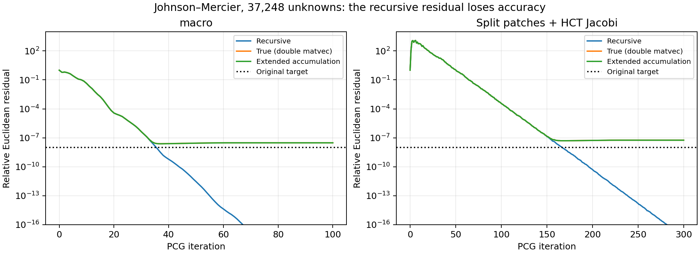

# Why the Johnson–Mercier iteration flattens out

The sharp late plateau is caused by finite-precision residual drift, rather
than a newly exposed slowly converging mode of the Hiptmair-style smoother.
There is a separate, much milder refinement trend before the plateau. Even
that trend is sensitive to the residual norm used to compare levels.



## Direct evidence

On the reference triangle at refinement 6 (37,248 unknowns), using the existing
operator, transfers, weights, and seeded moment-coordinate load:

| Smoother | Iteration | Recursive relative residual | Recomputed relative residual |
|---|---:|---:|---:|
| Macro | 40 | 5.97e-10 | 2.49e-8 |
| Macro | 100 | 2.33e-25 | 3.06e-8 |
| Split + HCT Jacobi | 150 | 1.33e-7 | 1.41e-7 |
| Split + HCT Jacobi | 200 | 5.09e-11 | 5.35e-8 |
| Split + HCT Jacobi | 300 | 5.45e-18 | 5.68e-8 |

The residual gap, `||(b-Ax)-r_recursive|| / ||b||`, becomes essentially the
entire recomputed residual. Both smoothers exhibit this behavior. Recomputing
`b-Ax` with long-double multiplication and accumulation gives 3.02e-8 for macro
and 5.66e-8 for split at the last iterations above. Thus it is not merely an
inaccurate *measurement* of an otherwise converged iterate: the stored iterate
really has this residual for the stored matrix.

CG updates `x` and its residual separately:

```
x <- x + alpha p
r <- r - alpha A p
```

In finite precision these cease to satisfy `r = b-Ax`. Once the corrections
are too small to change the stored `x`, the recursive residual can continue
shrinking while the recomputed residual is stationary. The original experiment controller
rejected convergence when the recomputed residual misses tolerance, but did
not replace CG's internal residual or restart its direction. Setting both CG
tolerances to zero then permits hundreds of meaningless iterations. The
historical macro result of 6.49e21 after 2000 iterations should not be treated
as evidence of an unstable V-cycle; the present histories establish loss of
residual fidelity long before that point. The precise later breakdown was
not traced here.

## Correct usage and cleanup

We use MFEM's serial `mfem::CGSolver` in `linalg/solvers.cpp`, not a Hypre or
PETSc solver. Its recursive residual update is standard CG practice.
`IterativeSolverController` receives const residual/solution vectors and can
request early stopping; it does not provide residual replacement. The original
experiment set both built-in tolerances to zero and used this interface to
veto convergence without restarting. That orchestration, not the standard CG
recurrence, caused the wasted iterations.

Originally, `b-Ax` was recomputed only when the recursive Euclidean residual
passed tolerance. After drift, that check could run on every remaining
iteration without affecting the internal recurrence. Per-iteration recomputation
was added for the diagnostic histories; it is not needed in normal runs.

Both `mg_compare` and `hx_compare` now use the shared `VerifiedPCG` helper in
`common.hpp`:

1. Run ordinary PCG with the requested relative preconditioned tolerance.
2. After it returns, check the true Euclidean relative residual.
3. If necessary, form a fresh residual with extended accumulation and solve
   `A delta = b-Ax` using the same preconditioner and inner relative tolerance
   0.01. Add the correction and verify again, with at most three corrections.
4. Report success only from the final true Euclidean residual.

MG's `-corrections` controls this bound; `0` disables correction. The iteration
limit applies separately to each solve. A failure after the bounded correction
attempts is reported honestly; it does not trigger an unlimited restart loop.
`-history` is passive and records only the initial PCG solve, with no stopping
logic. Normal runs do not install a controller or compute per-iteration true
residuals. No MFEM library solver code was changed.

At refinement 6, the cleaned-up default solves give:

| Smoother | Initial CG iterations | Correction CG iterations | Final true relative residual |
|---|---:|---:|---:|
| Macro | 29 | 9 | 5.78e-9 |
| Split + HCT Jacobi | 106 | 97 | 5.49e-9 |

MG reports initial and correction iterations separately; add them for total
work. HX's existing `iterations` column reports the total. The original
investigation's recursive-Euclidean stopping experiment instead took 36 + 9
iterations for macro and 167 + 30 for split; those initial stopping rules are
no longer used. Historical comparison CSVs therefore should not be mixed with
new iteration counts without noting the changed solve orchestration.

## What remains of the refinement trend?

For one pre/post smoothing step, the following are first threshold crossings
in the same histories. The preconditioned quantity is
`sqrt(r_k^T B_MG r_k / (r_0^T B_MG r_0))`, using the recursive residual. Crossings
in this table occur before the late residual plateau; this quantity should not
be trusted arbitrarily far into the plateau.

| Unknowns | Split: true Euclidean 1e-6 | Split: preconditioned 1e-8 | Macro: preconditioned 1e-8 |
|---:|---:|---:|---:|
| 2,400 | 110 | 95 | 27 |
| 9,408 | 124 | 101 | 28 |
| 37,248 | 138 | 106 | 29 |
| 148,224 | 153 | 110 | 29 |

Split's initial Euclidean residual peaks at approximately 101, 339, 1207, and
4444 times its initial value on these levels. CG minimizes the energy error,
not the unpreconditioned Euclidean residual; this transient amplification is
not by itself a sign of divergence. A fixed reduction of a random load in
moment coordinates is not a mesh-independent energy-error criterion.

Consequently, the Euclidean iteration counts mix transient amplification,
convergence rates, and eventual accuracy loss. They cannot by themselves
establish that the preconditioned condition number grows without bound.
The preconditioned counts still grow, but much more gently on the finer levels;
these data are compatible with approaching a limit and do not prove one.
Macro remains substantially more effective than split + HCT at these weights.

The next mathematical robustness check should estimate extremal preconditioned
eigenvalues or use independently evaluated energy errors. If those deteriorate,
test kernel preservation and approximation by the nonnested moment transfers,
and compare additive versus multiplicative potential smoothing. Neither a
failure of the kernel decomposition nor a transfer defect has been established
by the present experiments.

## Reproduction, data, and limits

Run from the repository root after building MFEM. Revision:
`43425e6cd42412b3cd8339c54e557af3db3dbd71` plus this investigation's uncommitted
experiment changes, including the shared PCG cleanup. GCC 16.2.1 20260819; Release builds; SuiteSparse enabled;
AMD Ryzen 7 5825U; `OPENBLAS_NUM_THREADS=1`. Timings include diagnostic work
when histories are enabled and are not benchmark comparisons.

```sh
cmake --build addisons_experiments/build --target mg_compare -j 4
mkdir -p addisons_experiments/output/stagnation_cleanup
export OPENBLAS_NUM_THREADS=1
addisons_experiments/build/mg_compare -r 7 -smoother split -max-it 300 -tol 1e-30 -corrections 0 \
  -history addisons_experiments/output/stagnation_cleanup/split_diagnostic_history.csv \
  > addisons_experiments/output/stagnation_cleanup/split_diagnostic.csv
addisons_experiments/build/mg_compare -r 7 -smoother macro -max-it 100 -tol 1e-30 -corrections 0 \
  -history addisons_experiments/output/stagnation_cleanup/macro_diagnostic_history.csv \
  > addisons_experiments/output/stagnation_cleanup/macro_diagnostic.csv
addisons_experiments/build/mg_compare -r 6 -smoother split -max-it 300 -corrections 3 \
  > addisons_experiments/output/stagnation_cleanup/split_corrected.csv
addisons_experiments/build/mg_compare -r 6 -smoother macro -max-it 100 -corrections 3 \
  > addisons_experiments/output/stagnation_cleanup/macro_corrected.csv
addisons_experiments/build/mg_compare -r 7 -smoother split -max-it 300 -corrections 3 \
  > addisons_experiments/output/stagnation_cleanup/split_corrected_deeper.csv
MPLCONFIGDIR=/tmp/jm-matplotlib python3 \
  addisons_experiments/johnson_mercier/analyze_stagnation.py \
  addisons_experiments/output/stagnation_cleanup
ctest --test-dir addisons_experiments/build --output-on-failure
```

The first two commands use an intentionally unattainable tolerance solely to
reproduce the original late plateau with the cleaned-up driver. They deliberately
exit 3 (tolerance missed); refinement-6
correction runs exit 0, and the deeper correction run exits 3.
All three standalone CTest entries pass, including a regression that makes
ordinary PCG pass its preconditioned tolerance while failing the true Euclidean
criterion, then verifies that a fresh correction meets that criterion. Selected data:
[refinement-6 histories](../results/mg_stagnation_history.csv),
[norm threshold crossings](../results/mg_stagnation_norms.csv), and
[corrected solves](../results/mg_stagnation_corrections.csv).
The Python script regenerates selected CSVs and the plot in the output directory.

Extended accumulation evaluates the already assembled double-precision matrix;
it does not repair assembly rounding or establish accuracy relative to the
exact variational problem. At refinement 7, uncorrected true residuals plateau
at 2.36e-7 (macro) and 4.62e-7 (split). Three corrections reduce the latter to
4.44e-8 (extended residual 3.02e-8), still above 1e-8, using 110 initial plus
100 correction iterations. Correction is not a guarantee of achieving an
arbitrarily strict Euclidean tolerance on finer meshes. Mesh-independent
spectral bounds and the underlying conditioning/scaling require separate work.
